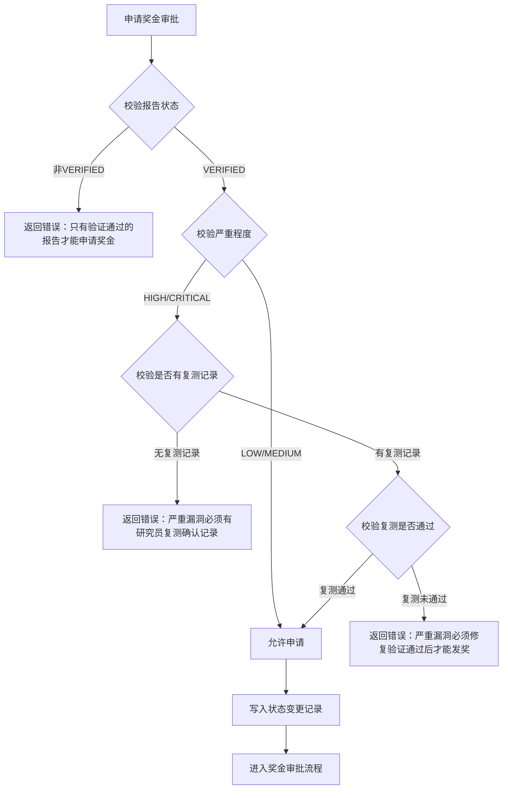
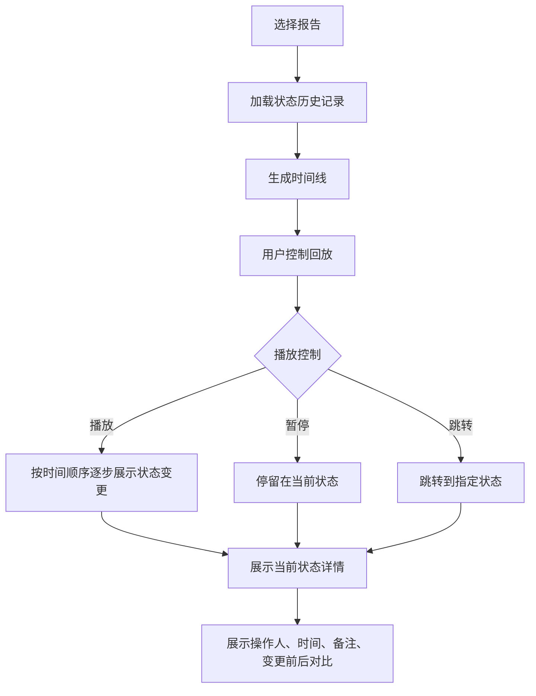

## 1. 产品概述

漏洞赏金报告处理全栈 Web 应用，实现"审计回放"功能，支持完整追溯漏洞报告从提交到最终处置的全生命周期。同时强化业务规则校验，确保"严重漏洞未修复不能发奖"，所有报告处理先校验再写入，失败项直接返回。

- 主要用途：安全团队审计漏洞报告处理流程、验证业务规则执行、追溯状态变更历史
- 目标用户：安全管理员、审计人员、赏金计划运营者
- 市场价值：提升漏洞赏金计划透明度，确保流程合规，满足审计监管要求

## 2. 核心功能

### 2.1 用户角色

| 角色 | 注册方式 | 核心权限 |
|------|---------|---------|
| 研究员 | 本地注册 | 提交漏洞报告、确认修复验证、查看个人报告 |
| 初审员 | 本地注册 | 审核报告、分派开发、标记重复 |
| 开发人员 | 本地注册 | 修复漏洞、标记修复完成 |
| 审批员 | 本地注册 | 审批奖金发放 |
| 管理员 | 本地注册 | 全功能权限、审计回放 |

### 2.2 功能模块

1. **审计回放页**：时间线展示报告全生命周期状态变更，支持逐步回放、操作人信息、操作详情
2. **报告处理页**：完整报告处理流程，含状态流转、业务校验
3. **奖金审批页**：奖金发放审批，含严重漏洞修复校验
4. **报告列表页**：报告筛选、查询、批量操作

### 2.3 页面详情

| 页面名称 | 模块名称 | 功能描述 |
|---------|---------|---------|
| 审计回放页 | 时间线模块 | 状态变更时间线，展示从提交到最终状态的每一步操作 |
| 审计回放页 | 回放控制模块 | 播放/暂停/上一步/下一步/跳转指定状态，播放速度控制 |
| 审计回放页 | 详情面板 | 展示当前状态的完整信息（操作人、时间、备注、相关数据） |
| 报告处理页 | 状态流转模块 | 支持提交、分派、修复、复测、验证、审批等全流程操作 |
| 报告处理页 | 校验模块 | 操作前业务规则校验，失败直接返回错误信息 |
| 奖金审批页 | 严重漏洞校验模块 | 校验严重/高危漏洞是否已修复并验证通过，未通过禁止发奖 |
| 报告列表页 | 筛选模块 | 按状态、严重程度、提交人等多维度筛选 |

## 3. 核心流程

### 3.1 报告处理主流程

研究员提交报告 → 初审员审核分派 → 开发人员修复 → 请求复测 → 研究员验证 → 申请奖金 → 审批员审批 → 公开致谢

每个步骤执行前先进行业务规则校验，校验不通过直接返回错误，不写入数据库。

### 3.2 严重漏洞发奖校验流程

### 3.3 审计回放流程

## 4. 用户界面设计

### 4.1 设计风格

- **主色调**：深科技蓝 `#0a1628`，代表安全与专业
- **强调色**：危险红 `#ef4444`（严重漏洞）、警告橙 `#f59e0b`（高危）、成功绿 `#10b981`（已修复）、信息蓝 `#3b82f6`（处理中）
- **中性色**：深灰 `#1e293b`、中灰 `#475569`、浅灰 `#94a3b8`、纯白 `#f8fafc`
- **字体**：标题使用 `JetBrains Mono` 等宽字体，正文使用 `Inter` 无衬线字体
- **布局风格**：暗色主题、卡片式布局、左侧导航、顶部状态栏
- **图标风格**：线性图标，使用 lucide-react

### 4.2 页面设计概述

| 页面名称 | 模块名称 | UI 元素 |
|---------|---------|---------|
| 审计回放页 | 时间线模块 | 垂直时间线，每个节点带状态标签、时间、操作人头像，颜色区分状态 |
| 审计回放页 | 回放控制模块 | 底部控制条，含播放/暂停、上一步/下一步、进度条、速度选择（0.5x/1x/2x） |
| 审计回放页 | 详情面板 | 右侧抽屉面板，展示当前状态的完整信息，含变更前后对比 |
| 报告处理页 | 状态流转模块 | 状态标签、操作按钮组，操作前显示校验提示 |
| 报告处理页 | 校验模块 | 红色错误提示条，列出具体校验失败原因 |
| 奖金审批页 | 严重漏洞校验模块 | 警告卡片，展示修复状态、复测记录、校验结果 |
| 报告列表页 | 筛选模块 | 顶部筛选栏，多条件组合查询 |

### 4.3 响应式设计

- 桌面端（≥1280px）：三栏布局（导航 + 主内容 + 详情面板）
- 平板端（≥768px）：两栏布局（导航折叠 + 主内容，详情面板抽屉式）
- 移动端（<768px）：单栏布局，底部导航，详情面板全屏

## 5. 业务规则

### 5.1 严重漏洞发奖规则

1. **硬校验规则**：严重（HIGH）和高危（CRITICAL）漏洞必须满足以下条件才能申请奖金：
   - 报告状态必须为 `VERIFIED`（已验证）
   - 必须存在至少一条 `isVerified: true` 的复测记录
   - 复测记录必须由提交报告的同一研究员创建

2. **校验时机**：
   - 调用 `requestBountyApproval` 时校验
   - 调用 `approveBounty` 时二次校验
   - 校验失败直接返回错误，不写入数据库

### 5.2 先校验后写入规则

1. 所有状态变更操作必须先执行完整的业务规则校验
2. 校验失败立即返回错误响应，包含具体失败原因
3. 校验通过后才执行数据库写入操作
4. 写入操作同时记录状态历史和审计日志

### 5.3 审计回放规则

1. 所有状态变更必须记录到 `StatusHistory` 表，包含：
   - 变更前状态（fromStatus）
   - 变更后状态（toStatus）
   - 操作人（changedById）
   - 操作时间（createdAt）
   - 备注（note）
2. 所有操作必须记录到 `AuditLog` 表，包含：
   - 操作类型（action）
   - 操作人（userId）
   - 关联报告（reportId）
   - 详情（details）
3. 审计回放数据仅允许查询，不允许修改和删除
