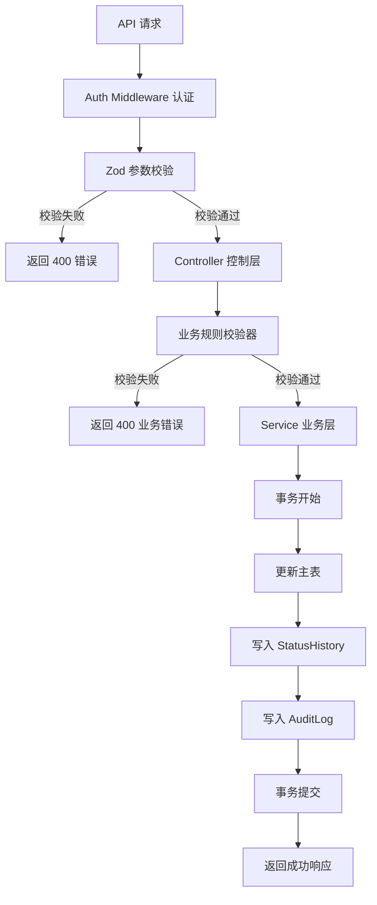
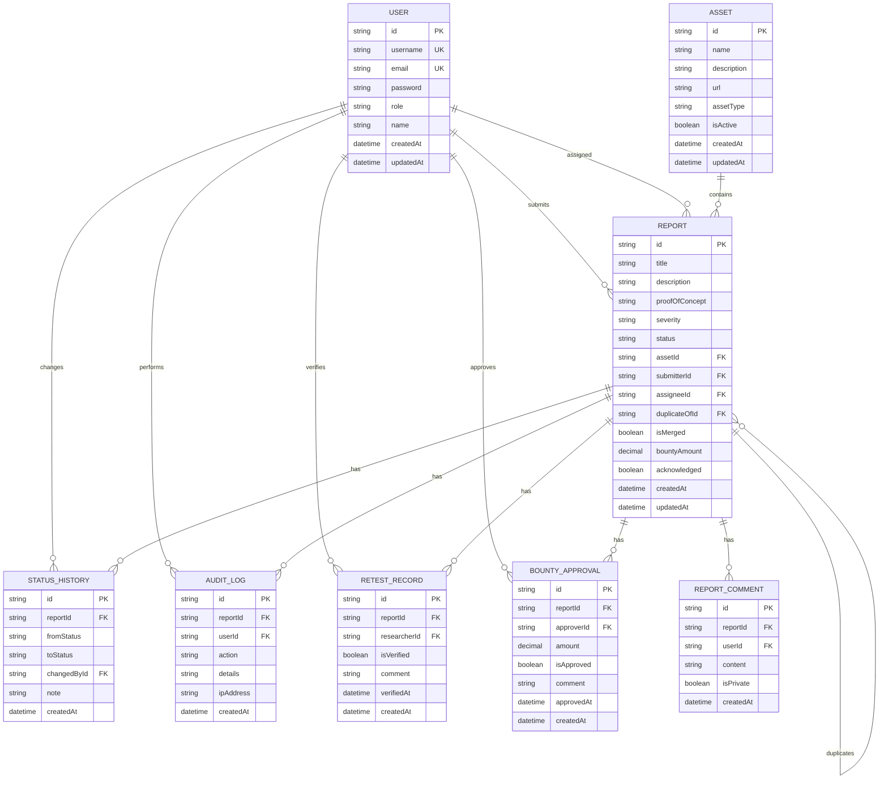

## 1. 架构设计


## 2. 技术说明

- **前端**：React@18 + TypeScript + Vite@5 + TailwindCSS@3 + Zustand@4 + React Router@6 + lucide-react
- **后端**：Express@4 + TypeScript + Prisma@5 + Zod@3
- **数据库**：SQLite（本地持久化，不接外部服务）
- **认证**：本地 JWT，不接外部账号系统
- **校验**：Zod 请求参数校验 + 业务规则校验器

## 3. 路由定义

### 3.1 前端路由

| 路由 | 页面 | 说明 |
|------|------|------|
| /login | LoginPage | 登录页 |
| /dashboard | Dashboard | 仪表盘 |
| /reports | ReportsList | 报告列表 |
| /reports/:id | ReportDetail | 报告详情 |
| /reports/:id/audit | AuditReplay | 审计回放页 |
| /reports/submit | SubmitReport | 提交报告 |
| /acknowledgments | Acknowledgments | 公开致谢 |

### 3.2 后端 API 路由

| 方法 | 路由 | 说明 |
|------|------|------|
| POST | /api/auth/login | 登录 |
| GET | /api/reports | 获取报告列表 |
| GET | /api/reports/:id | 获取报告详情 |
| POST | /api/reports | 提交报告 |
| GET | /api/reports/:id/audit | 获取审计回放数据 |
| POST | /api/reports/:id/assign | 分派报告 |
| POST | /api/reports/:id/start-fixing | 开始修复 |
| POST | /api/reports/:id/mark-fixed | 标记修复完成 |
| POST | /api/reports/:id/request-retest | 请求复测 |
| POST | /api/reports/:id/verify-fix | 验证修复 |
| POST | /api/reports/:id/request-bounty | 申请奖金 |
| POST | /api/reports/:id/approve-bounty | 审批奖金 |
| POST | /api/reports/:id/acknowledge | 公开致谢 |
| POST | /api/reports/:id/reject | 拒绝报告 |
| POST | /api/reports/:id/duplicate | 标记重复 |
| GET | /api/reports/:id/audit-logs | 获取审计日志 |
| GET | /api/assets | 获取资产列表 |

## 4. API 定义

### 4.1 审计回放 API

**请求**：`GET /api/reports/:id/audit`

**响应**：
```typescript
interface AuditReplayResponse {
  success: boolean
  data: {
    reportId: string
    reportTitle: string
    severity: Severity
    status: ReportStatus
    timeline: Array<{
      id: string
      fromStatus: ReportStatus | null
      toStatus: ReportStatus
      changedBy: {
        id: string
        name: string
        role: UserRole
      }
      note: string | null
      createdAt: string
      snapshot: {
        status: ReportStatus
        assigneeId: string | null
        bountyAmount: number | null
      }
    }>
    auditLogs: Array<{
      id: string
      action: string
      userId: string | null
      userName: string | null
      details: string | null
      createdAt: string
    }>
    retestRecords: Array<{
      id: string
      isVerified: boolean
      comment: string | null
      researcherName: string
      verifiedAt: string | null
      createdAt: string
    }>
  }
}
```

### 4.2 报告处理 API - 先校验后写入

**通用响应格式**：
```typescript
interface ValidationErrorResponse {
  success: false
  error: string
  details?: Array<{
    code: string
    message: string
    field?: string
  }>
}
```

## 5. 服务端架构图



## 6. 数据模型

### 6.1 数据模型定义



### 6.2 核心业务校验器

```typescript
// 业务规则校验器接口
interface BusinessRule<T> {
  name: string
  code: string
  validate: (data: T) => ValidationResult
}

interface ValidationResult {
  valid: boolean
  errors: Array<{ code: string; message: string }>
}

// 严重漏洞发奖校验器
class CriticalVulnerabilityBountyValidator implements BusinessRule<{
  report: Report
  currentUser: User
}> {
  name = '严重漏洞发奖校验'
  code = 'CRITICAL_BOUNTY_VALIDATION'

  validate(data: { report: Report; currentUser: User }): ValidationResult {
    const { report } = data
    const errors: Array<{ code: string; message: string }> = []

    const criticalSeverities: Severity[] = [Severity.HIGH, Severity.CRITICAL]
    
    if (criticalSeverities.includes(report.severity as Severity)) {
      // 校验1：状态必须是 VERIFIED
      if (report.status !== ReportStatus.VERIFIED) {
        errors.push({
          code: 'INVALID_STATUS',
          message: '硬校验：严重/高危漏洞必须修复并验证通过后才能申请奖金'
        })
      }

      // 校验2：必须有复测记录
      if (!report.retestRecords || report.retestRecords.length === 0) {
        errors.push({
          code: 'NO_RETEST_RECORD',
          message: '硬校验：严重/高危漏洞必须有研究员复测确认记录才能发奖'
        })
      } else {
        // 校验3：必须有通过的复测记录
        const hasVerifiedRetest = report.retestRecords.some(r => r.isVerified)
        if (!hasVerifiedRetest) {
          errors.push({
            code: 'RETEST_NOT_PASSED',
            message: '硬校验：严重/高危漏洞必须复测通过后才能发奖'
          })
        }

        // 校验4：复测必须由提交报告的研究员完成
        const hasSubmitterVerified = report.retestRecords.some(
          r => r.isVerified && r.researcherId === report.submitterId
        )
        if (!hasSubmitterVerified) {
          errors.push({
            code: 'INVALID_RETESTER',
            message: '硬校验：只有提交报告的研究员才能确认修复结果'
          })
        }
      }
    }

    return {
      valid: errors.length === 0,
      errors
    }
  }
}
```

### 6.3 初始数据

```sql
-- 初始用户数据
INSERT INTO User (id, username, email, password, role, name) VALUES
('uuid-researcher', 'researcher1', 'researcher1@example.com', '$2b$10$...', 'RESEARCHER', '张研究员'),
('uuid-triager', 'triager1', 'triager1@example.com', '$2b$10$...', 'TRIAGER', '李初审'),
('uuid-developer', 'developer1', 'developer1@example.com', '$2b$10$...', 'DEVELOPER', '王开发'),
('uuid-approver', 'approver1', 'approver1@example.com', '$2b$10$...', 'APPROVER', '赵审批'),
('uuid-admin', 'admin1', 'admin1@example.com', '$2b$10$...', 'ADMIN', '管理员');

-- 初始资产数据
INSERT INTO Asset (id, name, description, url, assetType) VALUES
('uuid-asset-1', '用户认证系统', 'Web应用用户登录认证模块', 'https://example.com/auth', 'WEB_APP'),
('uuid-asset-2', '支付网关', '在线支付处理系统', 'https://example.com/pay', 'API'),
('uuid-asset-3', '数据库服务', '核心业务数据库', 'db.example.com', 'DATABASE');

-- 测试报告数据 - 严重漏洞未修复场景
INSERT INTO Report (id, title, description, severity, status, assetId, submitterId) VALUES
('uuid-report-critical', 'SQL注入漏洞', '用户查询接口存在SQL注入漏洞...', 'CRITICAL', 'VERIFIED', 'uuid-asset-1', 'uuid-researcher');

-- 测试报告数据 - 严重漏洞已修复场景
INSERT INTO Report (id, title, description, severity, status, assetId, submitterId) VALUES
('uuid-report-fixed', '越权访问漏洞', '用户信息接口存在越权访问...', 'HIGH', 'VERIFIED', 'uuid-asset-2', 'uuid-researcher');

-- 为已修复报告添加复测记录
INSERT INTO RetestRecord (id, reportId, researcherId, isVerified, comment, verifiedAt) VALUES
('uuid-retest-1', 'uuid-report-fixed', 'uuid-researcher', 1, '漏洞已修复，复测通过', CURRENT_TIMESTAMP);
```

## 7. 脚本定义

### 7.1 check-834.sh 校验脚本

**功能**：验证"审计回放"和"严重漏洞未修复不能发奖"功能的完整性

**校验项**：
1. 检查报告状态历史记录完整性
2. 检查审计日志记录完整性
3. 验证严重漏洞发奖校验逻辑（成功路径 + 失败路径）
4. 验证先校验后写入逻辑
5. 验证审计回放 API 数据正确性

**使用方法**：
```bash
./scripts/check-834.sh
```

**退出码**：
- 0：所有校验通过
- 非0：存在校验失败，输出具体失败原因
